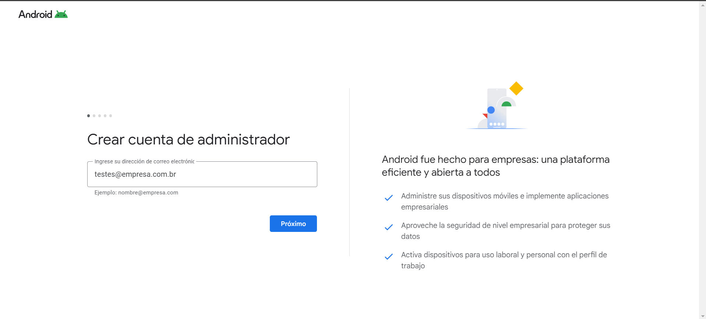

---
layout:
  title:
    visible: true
  description:
    visible: false
  tableOfContents:
    visible: true
  outline:
    visible: true
  pagination:
    visible: true
---

# Ajustes generales - Android - Work Profile

Profile es un modo de gestión exclusivo para dispositivos personales, permite que un usuario con su dispositivo personal pueda crear un entorno seguro para utilizar aplicaciones de trabajo, Garantizar la seguridad necesaria para la información de la empresa y la privacidad del usuario, ya que el dispositivo es personal.

Para ello, el usuario debe descargar la aplicación Android Device Policy en la tienda de aplicaciones y leer el QR CODE de la política con el modo de gestión "**Android - Work Profile**". Al final de la provisión, el dispositivo mostrará aplicaciones de trabajo con el icono del perfil de trabajo (maletín azul) y las aplicaciones privadas sin iconos.


**IMPORTANTE**

* No es necesario realizar el restablecimiento de fábrica en el dispositivo para realizar la provisión, simplemente descargue la aplicación " **Android Device Policy**" y siga los pasos de aprovisionamiento.
* Al ejecutar el comando "**Quitar dispositivo**" en el menú agrupado de la pantalla "**Lista de dispositivos**", se eliminan el perfil de trabajo del dispositivo y las aplicaciones de trabajo. No se reinicia el dispositivo.
* El usuario tiene autonomía para eliminar el perfil de trabajo a través del dispositivo, sin que sea necesaria la autorización del Administrador.
* Android Go admite escenarios de implementación totalmente administrados y dedicados. Sin embargo, el perfil de trabajo (BYOD) es opcional y por lo tanto ausente en la mayoría de los dispositivos Go.


Las configuraciones generales se agrupan en tipos:

* Restricciones de contraseña - Dispositivo
* Restricciones de contraseña - Perfil Laboral
* Trabajo

<figure><figcaption></figcaption></figure>

### Restricciones de contraseña - Dispositivo

<figure><figcaption></figcaption></figure>

### Restricciones de contraseña - Perfil Laboral

Si la clave está activada permite al usuario mantener la misma contraseña definida para el "Dispositivo" en el "Perfil de Trabajo".

Cuando la opción está desactivada, obliga al usuario a crear una contraseña diferente de la contraseña personal para acceder al perfil de trabajo. Se muestran las mismas configuraciones descritas en la tabla anterior para establecer la contraseña.

<figure><figcaption></figcaption></figure>

Sigue el detalle de la configuración de ambas restricciones de contraseña:

| Configuración                                                                 | Descripción                                                                                                                                                                                                                                     |
| ----------------------------------------------------------------------------- | ----------------------------------------------------------------------------------------------------------------------------------------------------------------------------------------------------------------------------------------------- |
| **Calidad de la contraseña**                                                  | 

En esta configuración, tenemos las siguientes opciones disponibles:
<ul><li>Ninguna</li><li>Biometría</li><li>Alguna</li><li>Numérica</li><li>Complejo Numérico</li><li>Alfabético</li><li>Alfanumérica</li><li>Compleja</li></ul> |
| **Historial máximo de contraseñas que el usuario no podrá volver a utilizar** | Define el número de contraseñas que ya se han usado y no pueden ser reutilizadas                                                                                                                                                                |
| **Máximo de contraseñas incorrectas antes de ejecutar wipe**                  | Define o máximo de tentativas incorretas antes de executar ou Wipe                                                                                                                                                                              |
| **Tiempo de espera de expiración de la contraseña (días)**                    | Define cuántos días la contraseña va a tardar en expirar                                                                                                                                                                                        |
| **Requerir desbloqueo de contraseña**                                         | En esta configuración tenemos las opciones: Dispositivo predeterminado, es decir, definido como configurado en el dispositivo o todos los días, en este caso la contraseña se pedirá todos los días                                             |

### Trabajo

Esta funcionalidad permite al usuario administrador configurar un bloqueo total del dispositivo fuera de un período de tiempo específico. De esta manera, permitiendo que se realice el bloqueo del dispositivo cuando el usuario no está en horario de trabajo.

Estando en la pestaña "**Ajustes**" de la pantalla "**Editar políticas**", haga clic en "**Trabajo**" para ver las opciones de configuración.

<figure><figcaption></figcaption></figure>

Para realizar el bloqueo de dispositivos fuera del horario laboral, siga los pasos a continuación:

1. Active la opción "Bloquear dispositivo fuera del horario de trabajo".
2. Rellene el campo "Días de trabajo", con los días trabajados en la semana del día de inicio y del día de fin.
3. Rellene el campo "Horario de trabajo", con horario de trabajo inicial y final.

<figure><figcaption></figcaption></figure>


Nota:&#x20;

Al dejar los campos en blanco el sistema considera todo el período del día."

